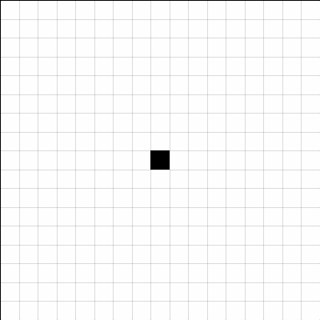

# Artificial Morphogenesis using Evolutionary Cellular Automata

An evolutionary algorithm that breeds 2D cellular automata rules capable of growing a target pattern from a single seed cell.



*CA evolving to produce the fine stripes pattern (pixel IoU fitness, 200 generations).*

---

## Fitness functions:

| Function | Description |
|---|---|
| `pixel_iou` | Binary intersection-over-union at the pixel level |
| `boundary_shape` | Edge mask IoU and area overlap |
| `distance_morphology` | Distance-transform shape matching (multi-scale) |

---

## Setup

```bash
git clone https://github.com/wgreenwood4/artificial-morphogenesis-evo.git
cd artificial-morphogenesis-evo
pip install -e .
```

---

## Running Experiments

1. Edit `configs/config.yaml` to configure your run.
2. Run the experiment:

```bash
python run_config.py
```

Results are written to `outputs/` as they complete.

### Output Structure

```
outputs/<fitness>
├── solns/<pattern>/<pattern>_expr<n>.json # Best genome (rule set) found
<fitness>.csv
```

---

## Analysis

After a run, use the scripts in `analysis/` to inspect results.

### Qualitative

```bash
# Extract the best individual per pattern across all experiments
python analysis/qualitative/get_best.py

# Render GIF animations for the best solutions
python analysis/qualitative/make_gifs.py

# Save the best final frame as a PNG
python analysis/qualitative/render_best_frames.py
```

### Figures

```bash
# Fitness convergence curves across generations and patterns
python analysis/figures/fit_step_convergence.py

# Cross-pattern IoU similarity matrix
python analysis/figures/similarity_matrix.py
```

---

## Authors

William Greenwood, Phil Marino, Ethan Weathers.
